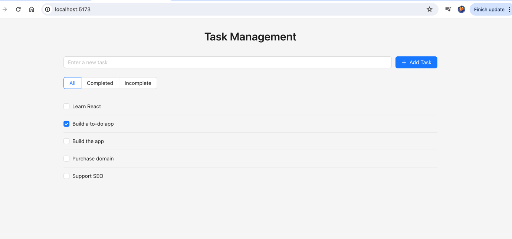
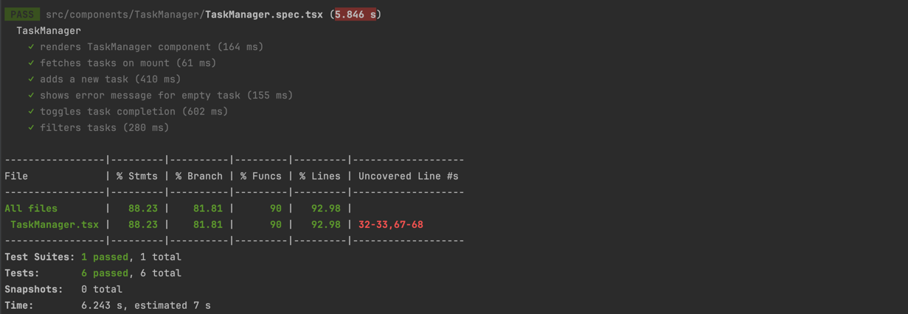

# HCU Frontend Coding Test

## How to install and run

- Node version `18.20.4`, npm version `10.7.0`
- How to run and build the project locally

```shell
nvm use node 18

npm install

# To start on local
npm run dev
# then navigate to http://localhost:5173/

# To run test
npm run test
```

## Additional Features

- [X] UI/UX: app is simple and user-friendly
- [X] Component Library: Effective usage of a component library to streamline the UI. (Ant Design)
- [X] Mock API with axios-mock-adapter
- [X] Add form validation to prevent empty tasks from being added.
- [X] Write unit tests for components using React Testing Library.
- [X] Configure Prettier and ESLint

## User Interface



## Test results and coverage

